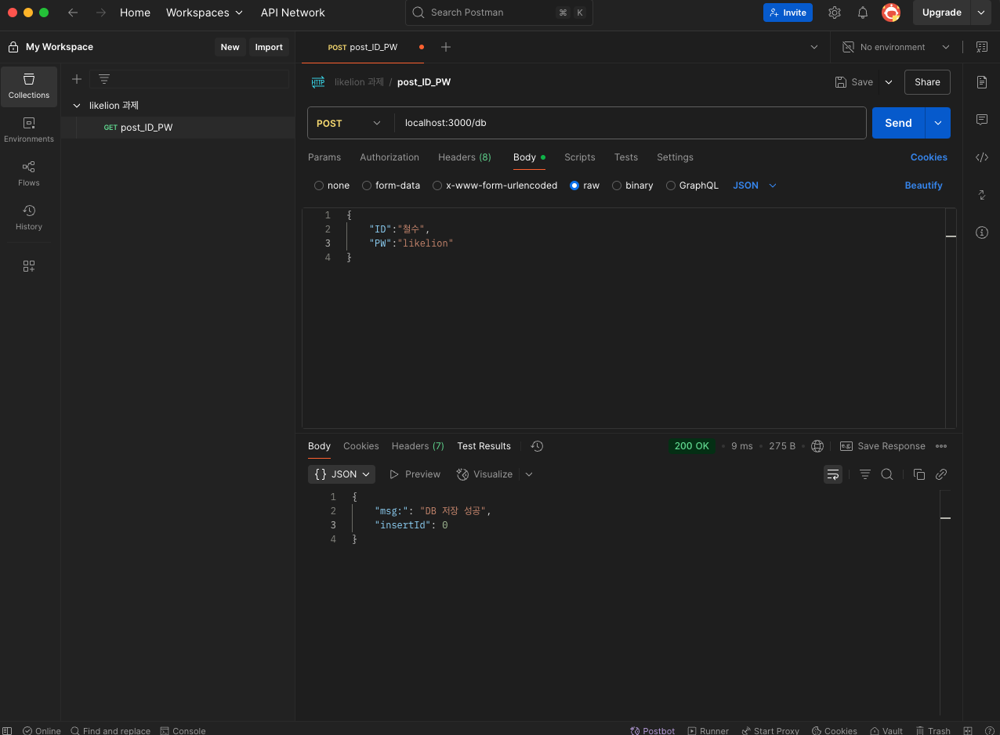
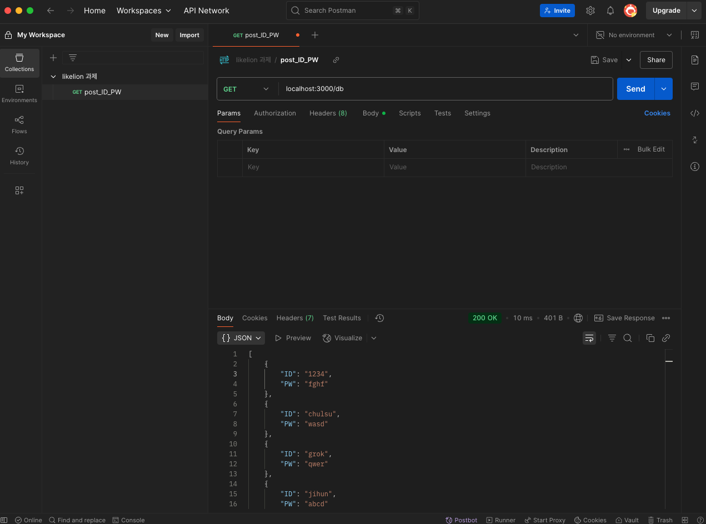

# MySQL - Postman 실습 과제
## 목적 
VScode에서 Express파일과 MySQL을 연결하고 Postman을 사용해 API요청을 테스트해보며, DB의 기본을 실습하기 위한 과제이다

## 과정
1. 새DB생성 - DB명은 본인이름
2. 새로 만든 DB에 USER Table 생성 후 ID/PW 저장 
3. POST 요청 구현 - Postman 사용하여 app.post() ID,PW 저장되도록 구현
4. GET 요청 구현 - localhost:3000/db로 접속하여 USER 데이터 확인
5. GitHub에 과정 업로드 및 제출

## 실행 결과
| 단계 | 설명 | 스크린샷 |
|------|------|----------|
| DB- Table 생성 | 'JIHUN이라는 DB생성 후 USER Table생성 | 
| 단계 | 설명 | 스크린샷 |
| Post요청 | 'Postman를 통해 Post하기 | 
| 단계 | 설명 | 스크린샷 |
| GET요청 | 'Postman를 통해 GET요청 후 값 확인 | 

## 요약 및 결과 및 후기
- JIHUN DB 생성 및 Table에 ID/PW 저장
- Postman를 사용해 Post-GET 해보기
- 몇번의 시행착오가 있었지만 백엔드에서 핵심이라고 볼 수 있는 DB를 체험해볼 수 있어서 좋았다 추후 실제 프로젝트를 할때 도움이 될 것 같아 뿌듯하다
